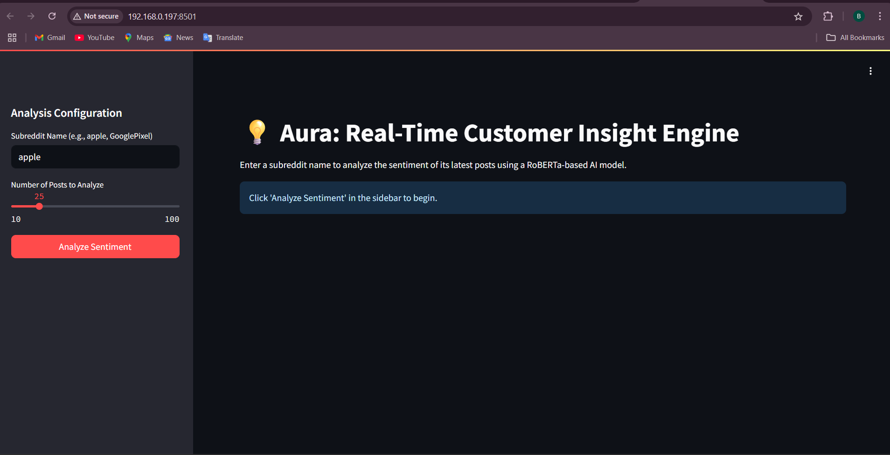

# Aura: Insight Engine

**Author:** MOHAMMED ZAID AHMED  
**Repository:** [Aura-Insight-Engine](https://github.com/Zaid2044/Aura-Insight-Engine)

Aura is a modular AI engine designed to extract actionable insights from unstructured data using NLP, intelligent summarization, and context-aware classification. It empowers decision-making by translating raw information into clarity.

---

## 🧠 Features

* 📝 Summarizes large text data intelligently
* 🧾 Topic modeling and keyword extraction
* 🔍 Semantic search across document sets
* 🧠 Sentiment and intent classification
* 📂 Modular architecture for easy customization

---

## ⚙️ Tech Stack

* **Language:** Python
* **Libraries:** spaCy, Transformers, NLTK, Gensim, Scikit-learn
* **Frameworks:** Flask (for serving), Jupyter (for prototyping)

---

## 🔍 Core Modules

* `summarizer.py` → Extractive & abstractive summarization
* `classifier.py` → Sentiment and topic classification
* `engine.py` → Orchestrates modules for pipeline execution
* `data/` → Sample documents for analysis
* `notebooks/` → Experimentation and prototyping notebooks

---

## 🚀 Setup Instructions

1. **Clone the repo**

   ```bash
   git clone https://github.com/Zaid2044/Aura-Insight-Engine.git
   cd Aura-Insight-Engine
   ```

2. **Create a virtual environment**

   ```bash
   python -m venv venv
   .\venv\Scripts\activate
   ```

3. **Install dependencies**

   ```bash
   pip install -r requirements.txt
   ```

4. **Run the engine**

   ```bash
   python engine.py
   ```

---

## 📊 Demo

Aura transforms complex documents into clear, concise insights.
Below is a snapshot of the system analyzing a large text and outputting a summarized result:

<p align="center">
  
</p>

---

## 📁 File Structure

```
Aura-Insight-Engine/
├── engine.py
├── summarizer.py
├── classifier.py
├── requirements.txt
├── data/
│   └── sample.txt
├── notebooks/
│   └── prototype.ipynb
```

---

## 🌱 Future Upgrades

* Integration with PDF/document parsers
* Real-time document insight dashboard
* Multilingual summarization and classification
* Voice-to-text insight engine

---

## 📜 License

This project is licensed under the MIT License.

---
